> **Piks** **AI** **:** **Personalized** **Advertising** **using**
> **Image** **Classification** Final Phase
>
> Sai Venkat Reddy,Parag Shah, Prajakta Jhade

**<u>PROJECT OVERVIEW</u>**

The objective of this project is to develop an image classification
system that can categorize images based on the location depicted in
them. By using deep learning techniques, we aim to classify images into
specific groups such as railway stations, bus stops, airports, etc This
classification will be instrumental in enhancing targeted advertising
techniques on social media platforms which ultimately benefit both
advertisers and users .

The growth of social media usage has resulted in an abundance of user
generated content including images. These images contain valuable
information about the user's activities and preferences. By analyzing
images and accurately identifying the locations depicted we can infer
patterns in users behavior and frequent visits to particular places.
This information can be used to deliver more relevant advertising to
users and improve their overall experience.

**<u>ABOUT DATASET</u>**

We are using places 365 dataset, which consists of images of different
places with labels. The dataset consists of nearly 365 different sets of
labels, but we are only choosing 10 labels as we are doing our project
for marketing purposes. We are choosing the most prominent areas where
we can market our products, the following are the places we have
chosen:-

> 1\. Airport terminal 2. Auditorium
>
> 3\. Book store 4. Bedroom 5. Bus_station
>
> 6\. Computer Room 7. Clothing_store 8. Food Court
>
> 9\. Jewelry_shop 10. Railroad_track

We have selected these places for training and testing. Each label
consists of 5000 high resolution images.

Dataset link : MIT places 365 from
[<u>http://places.csail.mit.edu/</u>](http://places.csail.mit.edu/)

**<u>ARCHITECTURES:</u>**

**<u>1.ResNet:</u>**

For our problem we created ResNet18, resNet architecture is useful for
image classification problems as with depth of layer the model is able
to capture more properties of the sample image.

ResNet introduced the idea of residual blocks. This helps in resolving
the problem of Vanishing/Exploding gradient during training. The
technique known as “skip connection”, which connects activations of a
layer to further layers by skipping some layers in between. This forms a
residual block.

The ResNet Architecture is made by stacking the residual blocks. This
skip connection helps in creating a very deep neural network, as if any
layer hurts the performance of the architecture then it will be skipped
by regularization.

**Model** **Architecture** **ResNet18:**

Model consists of convolution layer, residual layers and fully connected
layer, along with this layer, model used max pooling, batch
normalization and Relu activation function.

**ResidualBlock:**

It consists of either 2 or 3 convolution layers and a residual value.

Layer 1: Conv2d with in_channel, out_channel, kernal_size =3,
stride=(user define), padding=1 and bias=False.

Intermediate: Applied BatchNormalize and Relu activation to the previous
output.

Layer 2: Conv2d with out_channel, out_channel, kernal_size =3, stride=1,
padding=1 and bias=False.

Intermediate: Applied BatchNormalize to the previous output.

Layer 3: (Down Sample layer): Conv2d with in_channel, out_channel,
kernal_size =1, stride=(user define), and bias=False.

**ResNet** **Architecture:**

Layer 1: Conv2d with in_channel = 3, out_channel = 64, kernal_size =7,
stride=2, padding=3 and bias=False.

Intermediate: Applied BatchNormalize and Relu activation to the previous
output. Layer 2: Max Pooling with kernal_size =3, stride=2, padding=1.

Layer 3: Residual block with in_channel = 64, out_channel = 64,
number_of_block=2, stride=1.

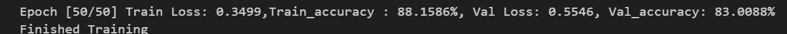

Layer 4: Residual block with
in_channel = 64, out_channel = 128, number_of_block=2, stride=2.

Layer 5: Residual block with in_channel = 64, out_channel = 256,
number_of_block=2, stride=2.

Layer 6: Residual block with in_channel = 64, out_channel = 512,
number_of_block=2, stride=2.

Layer 7: Adaptive Average pooling with output size of 1x1.

Final Layer: Fully connected layer with input = 512 and output = number
of classes (15)

For the model we used cross Entropy loss as a loss function and Adam as
an optimizer with learning rate of 0.001, and weight decay of 10−4.

Moreover we used the <u>‘ReduceLROnPlateau’ s</u>cheduler for learning
rate scheduling during the training, with mode as min, factor of 0.1 and
patience of 3.

**Optimization** **technique:**

We used dropout regularization of ratio 0.5 in the fully connected
layer, which made the output of random neurons to zero. This makes the
model learn better and add robustness to the model.

**<u>EVALUATION METRICS:</u>**

<u>Training and Validation Accuracy:</u>

**Training** **Accuracy** **:** **88.15%** **Validation** **Accuracy:**
**83.08%**

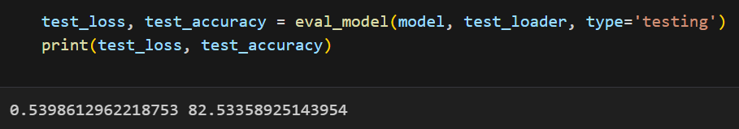<u>Testing Accuracy:</u>

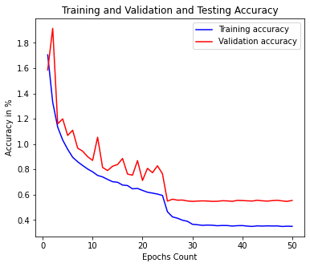

<u>Plot for Training and Validation Loss:</u>

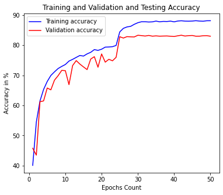<u>Plot
for Training and Validation Accuracy:</u>

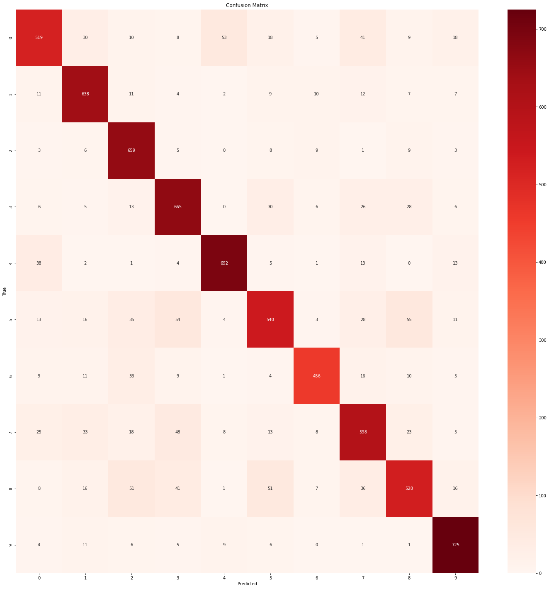

<u>Correlation matrix:</u>

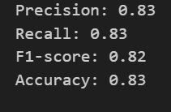<u>Precision, Recall, F1 and
Accuracy:</u>

**<u>2. VGG</u>**

We are using VGG 13 architecture. This VGG 13 architecture has 5 sets of
layers, each with two convolution layers followed by max pooling layers.

The filters will increase from 64 to 512 in these 5 sets and the input
will be given to a fully connected neural network with 3 layers.

Layer 1:- conv1 with input channels 3 output channels 64, and kernel
size 3 with padding=1.

Layer 2:- conv1 with input channels 64 output channels 64, and kernel
size 3 with padding=1.

Layer 3:- conv1 with input channels 64 output channels 128, and kernel
size 3 with padding=1.

Layer 4:- conv1 with input channels 128 output channels 128, and kernel
size 3 with padding=1.

Layer 5:- conv1 with input channels 128 output channels 256, and kernel
size 3 with padding=1.

Layer 6:- conv1 with input channels 256 output channels 256, and kernel
size 3 with padding=1.

Layer 7:- conv1 with input channels 256 output channels 512, and kernel
size 3 with padding=1.

Layer 8:- conv1 with input channels 512 output channels 512, and kernel
size 3 with padding=1.

Layer 9:- conv1 with input channels 512 output channels 512, and kernel
size 3 with padding=1.

Layer 10:- conv1 with input channels 512 output channels 512, and kernel
size 3 with padding=1.

Max Pooling Layers: Max pooling layers applied after conv1 and conv2
convolutional layers with a kernel size of 2 and stride of 2.
Subsequently after every two consecutive convolutional layers max
pooling layer with a kernel size of 2 and stride of 2 is applied.

● Fully Connected Layer 1:- fc1 with input size 512 \* 2 \* 2 which is
flattened after pooling and output size 4096.

● Fully Connected Layer 2:- fc2 with input size 4096 and output size
4096.

● Fully Connected Layer 3:- fc3 with input size 4096 and output size
equal to the number of classes (=3).

Batch normalization: Batch normalization is done after every layer to
stop the weights from getting extremely large and small

Activation Function:- ReLU activation function is used for convolutional
and fully connected layers.

Dropout : Dropout layer is used after every set(2 layers) to drop the
few neurons to protect from overfitting.

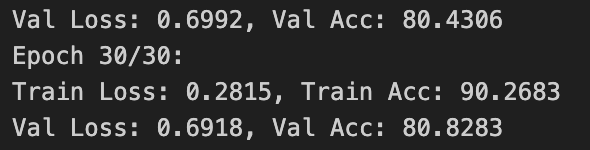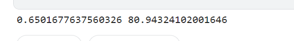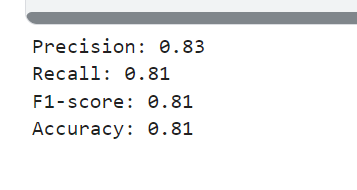

<u>EVALUATION METRICS:</u>

**Testing**

**The** **loss** **is** **0.65** **and** **accuracy** **is** **80.94**

**Plots**

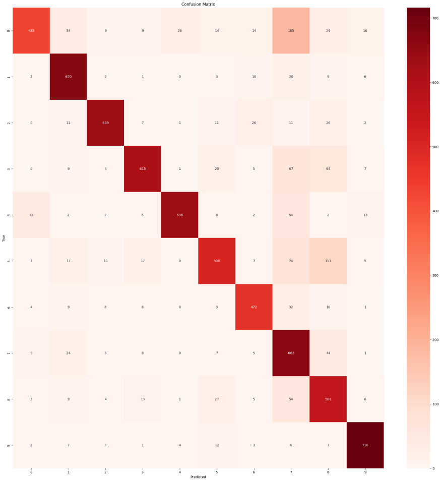

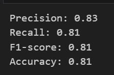<u>Precision, Recall, F1 and
Accuracy:</u>

**<u>3. DenseNet</u>**

The DenseNet architecture is designed to gradient flow of gradient and
parameter efficiency by connecting each layer with every other layer in
feed forward. This connectivity pattern helps to reduce the vanishing
gradient problem and improves feature propagation throughout the
network.

**DenseNet** **Architecture:**

<u>1. Dense Layer:</u>

Dense layer consists of 2 Convolution layers and a dropout of 0.1 (10
%).

> Each dense layer consists series of operations:-
>
> <u>Batch Normalisation</u> : normalizes input across the mini-batch to
> stabilize and accelerate training. <u>Convolution layers</u>: applies
> a 1x1 convolution followed by a 3x3 convolution to extract feature
> maps. <u>ReLU activation</u> : introduces non-linearity to the
> network.

<u>Dropout:</u> Value of 10%.

Output of every dense layer is concatenated with its input to create a
dense connecting pattern.

<u>2. Dense Block:</u>

A dense block consists of multiple dense layers which are stacked
sequentially. All the input_channels are increasing with ‘k = 32’
factor.

> The number of layers in each dense block and the number of input
> channels is updated dynamically as layers are added.

<u>3. Transition Layer:</u>

Transition layers consists of,

> <u>Batch Normalisation</u> : normalizes input across the mini-batch to
> stabilize and accelerate training. <u>Convolution layers:</u> Conv2d
> layer with kernel size of 1 and input channel, output channels, where
> output

is reducing with compression factor of 0.5.

<u>Average pooling: T</u>he output is passed through the avgpool layer.

<u>4. DenseNet Architecture:</u>

This Combines multiple dense blocks which are separated by a transition
layer.

Begins with a convolutional layer and followed by batch normalization
ReLU activation and max pooling. And this ends with a global average
pooling layer and a fully connected layer for classification.

DenseNets architecture helps in feature reuse, reduces no.of parameters
and enhances gradient flow.

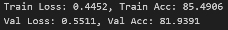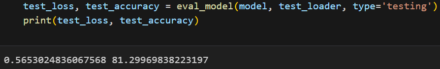

**<u>EVALUATION METRICS:</u>**

<u>Training and Validation Accuracy:</u>

<u>Testing Accuracy:</u>

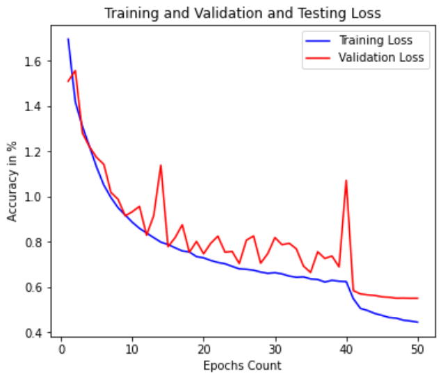<u>Plot for Training and
Validation Loss:</u>

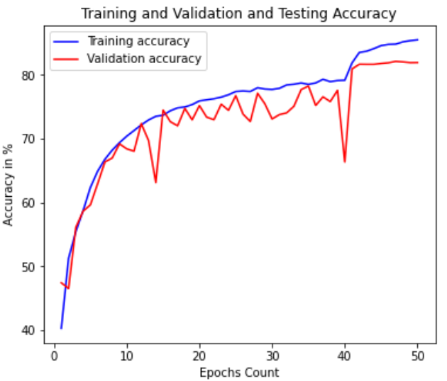

<u>Plot for Training and Validation Accuracy:</u>

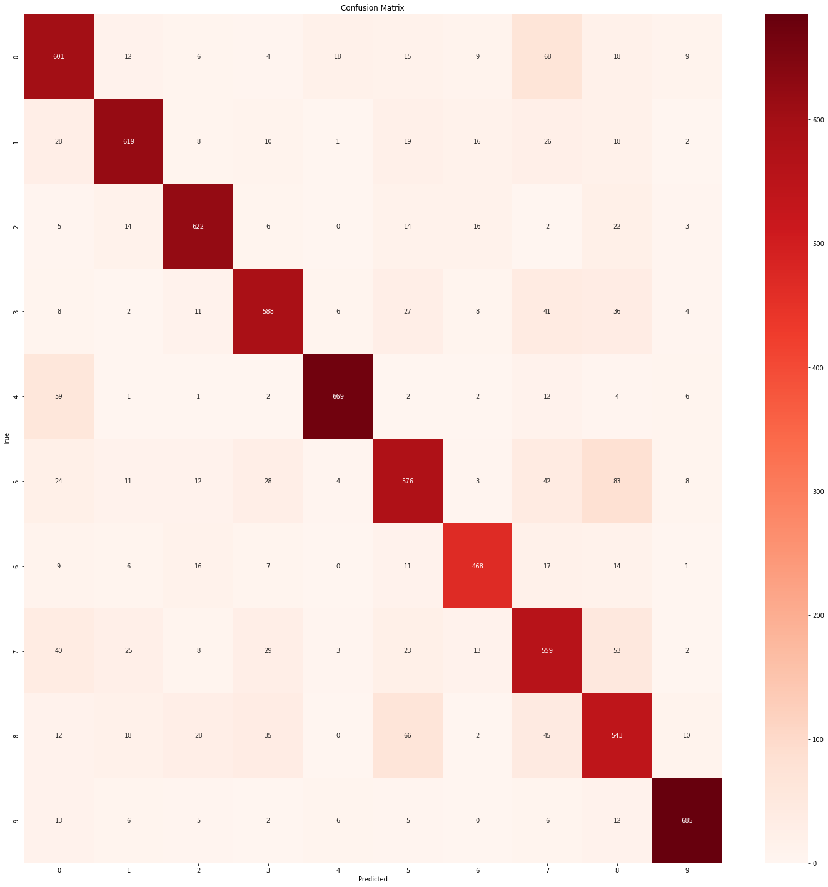<u>Correlation matrix:</u>

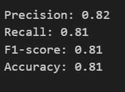

<u>Precision, Recall, F1 and Accuracy:</u>

**<u>4. AlexNet</u>**

AlexNet is classic convolutional neural network architecture known for
its performance in the imagenet large scale visual recognition challenge
in 2012. Here's a detailed explanation of the architecture based on our
code

**AlexNet** **Architecture**

1\. Convolutional Layer 1 :- layer 1 take the input image with 3
channels and applies a convolution with 64 filter of size 11\*11. The
stride = 4 reduces spatial dimensions and padding of 2 ensures that
output size is reduced but not excessively. Next the output passed
through the ReLU activation function and max pooling layer that reduces
the spatial dimensions.

2\. Convolutional Layer 2 :-layer 2 takes the 64 channel input from
layer 1 and applies convolution with 192 filters of size 5x5 which is
followed by ReLU activation and max pooling.

3\. Convolutional Layer :- layer 3 increases depth to 384 channels using
3\*3 filters and ReLU activation function. layer doesn't include pooling
which maintains the spatial dimension for next convolutional layer.

4\. Convolutional Layer 4: layer 4 further processes the input with 256
filter of size 3\*3 which is followed by ReLU activation function, no
pooling is applied here.

5\. Convolutional Layer 5:- layer 5th also uses 256 filters of size 3\*3
followed by ReLU and a final max pooling layer to reduce the spatial
dimensions before the fc layers.

6\. Fully Connected Layer 1:-The feature map from convolutional layers
are flattened into a 1-D vector of 9216 size. The vector is passed
through a fully connected layer with 4096 units which is followed by
ReLU activation and dropout layer to prevent overfitting.

7\. Fully Connected Layer 2:-The second fc layer also has 4096 units
which is followed by ReLU activation and dropout.

8\. Output Layer:- The final fully connected layer outputs a vector of
size equal to the number of classes (= 11).

Activation Function:- ReLU activation function is used for convolutional
and fully connected layers.

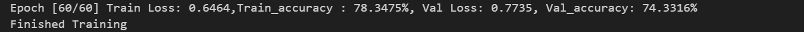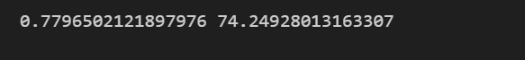

Batch normalization: The batch normalization layer is added after all
the layers except 1st layer to control excess change in weights

**<u>EVALUATION METRICS:</u>**

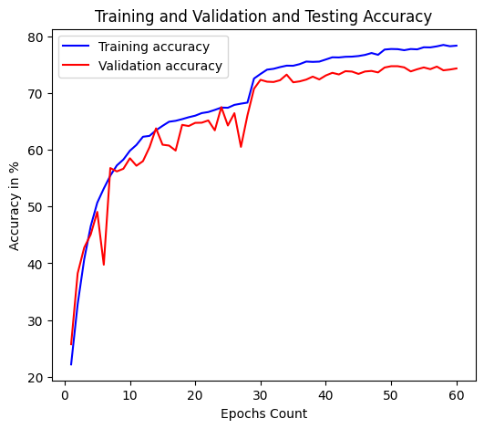Test
loss is 0.779 and accuracy is 74.24

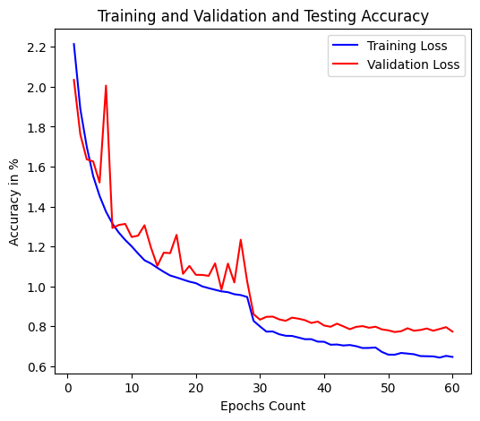

> This is Loss curve mistakenly named accuracy.

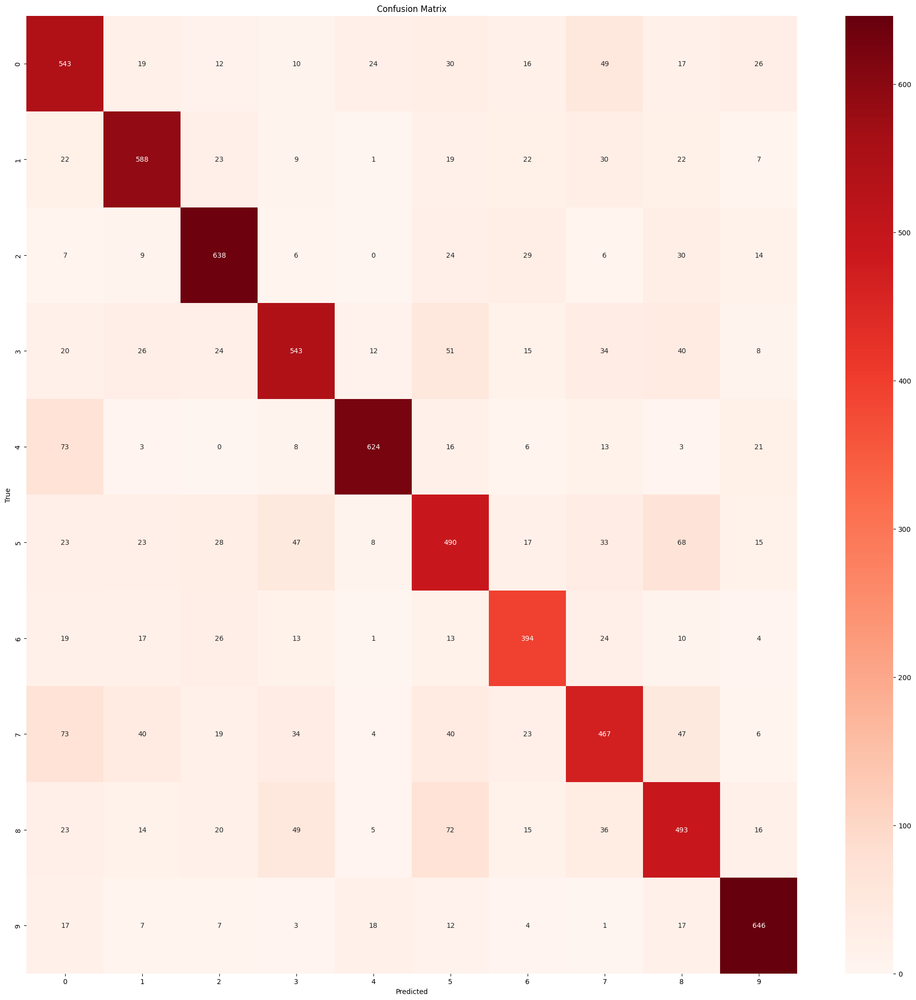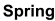

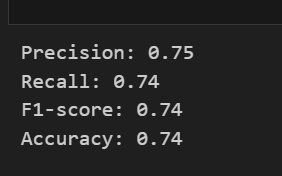<u>Precision, Recall, F1 and
Accuracy:</u>

**<u>MODEL DEPLOYMENT:</u>**

To enhance the user experience and showcase the model we have deployed
the model locally.

<u>Login Page and Home Page:</u>

The user will enter into the page by using his login credentials and see
that there will be an option to upload one or more images. Users can
upload images using the upload functionality on the home page, the same
way can be done in social media platforms as feed. As shown in <u>figure
1 and figure 2.</u> Once the images are uploaded the user can see the
uploaded images on his dashboard and can also delete it in future, as
shown in the <u>figure 3</u>.

When the user will upload 3 images (In practical the images from social
media will be directly taken). The model will take these 3 images and
give them to our Ensembled Deep Learning model.

<u>Ensembled Deep Learning model:</u>

We are combining all our four models to predict the label for our final
use case, we are giving the image to all our models and asking them to
predict the label. When each of the models predicts the label we take
the labels and see if all of them predicted the same label.

If the models predict the image differently we have given the priority
to the prediction based on their accuracy on the test data, Alexnet
being the least priority model and Resnet being the highest priority
model.

After this all the three images will get their labels and now we will
choose the label which is repeated among those 3 labels to identify the
most posted image of the customer and show the ad related to that label,
if 3 of them are different images we will choose the ad randomly among
the three labels.

There will be 3 different ads related to one label, they are shown once
we finalize which ad is to be shown using the image labels and
personalized message is shown to the user, as shown in the <u>figure
4.</u>

<u>About Application:</u>

Apart from the main application home page, users also can check the
about section, where users can get the insight about the dataset used,
and the model structures which are used for predicting the labels for
the input images. As shown in the <u>figure 5 and 6</u>.

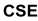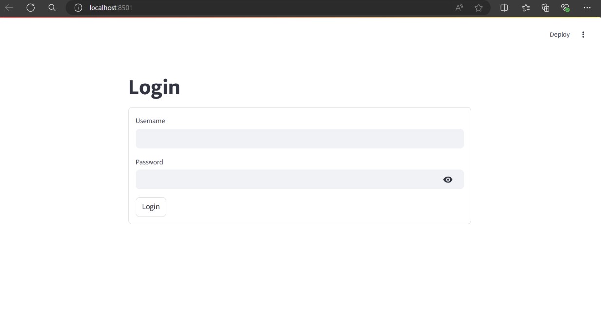

**<u>INTERFACE:</u>**

> <u>Figure 1</u>
>
> <u>Figure 2</u>

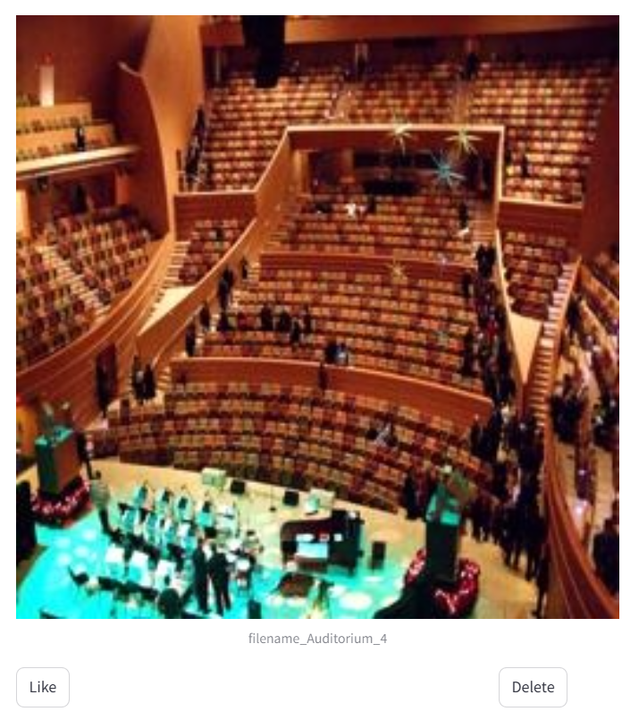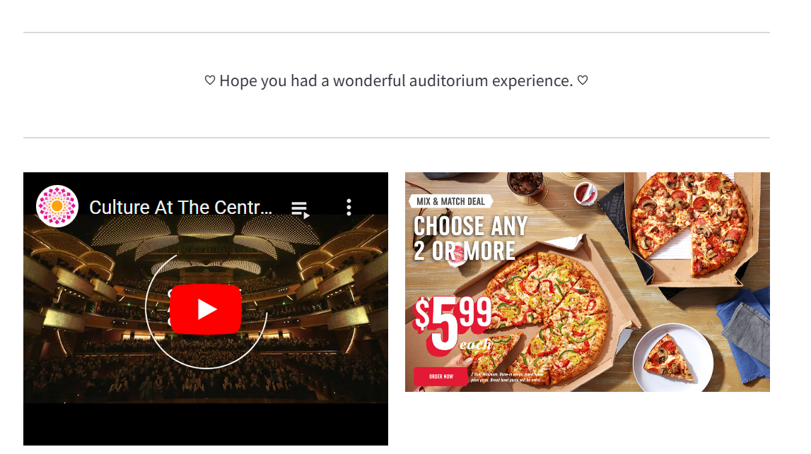

> <u>Figure 3</u>
>
> <u>Figure 4</u>

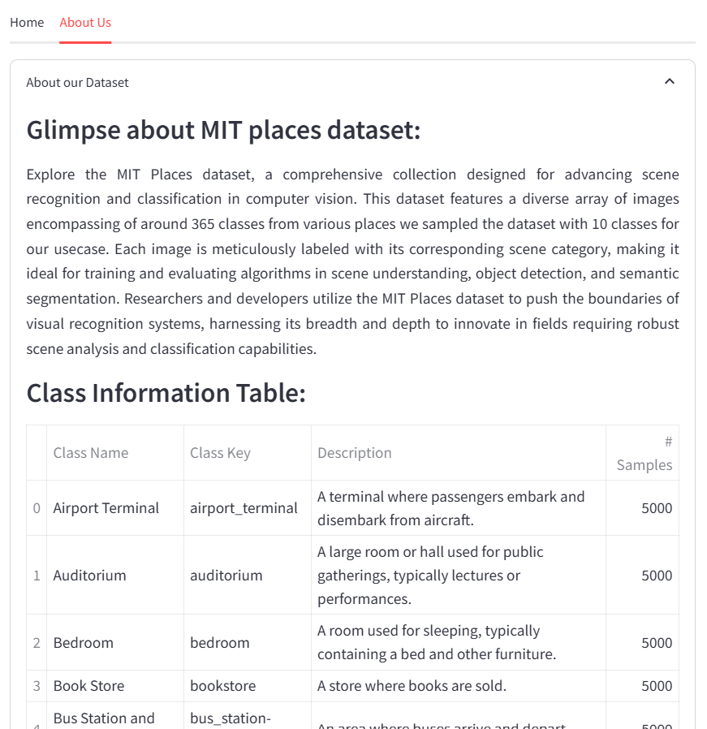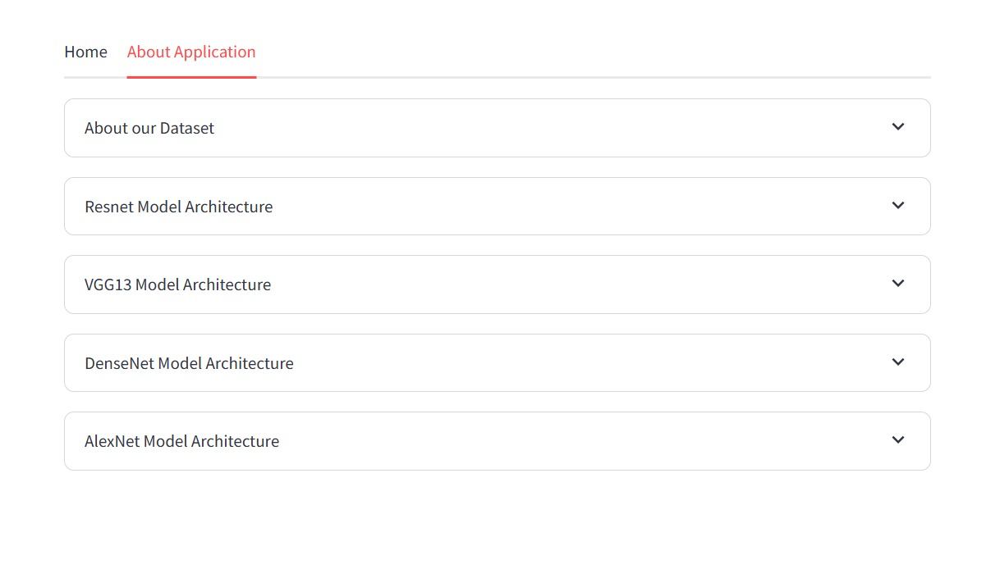

> <u>Figure 5</u>
>
> <u>Figure 6</u>

> **<u>REAL WORLD SCENARIO (Bonus):</u>**
>
> This is a real life application, as the insight gained from analyzing
> user generated images can significantly impact advertising strategies.
> Relevant advertisement not only increases the effectiveness of
> marketing campaigns for advertisers but also helps the user experience
> by providing content that aligns with their interest and activities.
> The application of deep learning in this context addresses a tangible
> need in the industry which demonstrates the practical utility and
> impact of advanced image classification techniques.
>
> **<u>PROJECT TOOL:</u>**
>
> We have used GitHub as our project management tool. It helped in
> seamless collaboration among team members by providing a centralized
> platform for code management and version control.
>
> **<u>SCRUM CALL</u>**
>
> Additionally, we have attended all the scrum meetings: three with
> Manasi Jadhav, one with Sirja Kota, and one with Lan Zhang to receive
> regular feedback on the progress of our project.
>
> **<u>CONTRIBUTION:</u>**
>
> We all have worked collaboratively on the project each contributing
> equally to its successful completion:
>
> **Parag** **Shah** led the development of the user application using
> Streamlit and worked on the AlexNet model. Also contributed to the
> ResNet architecture and partially worked on the DenseNet model.

> **Prajakta** **Jhade** concentrated on the DenseNet architecture and
> offered assistance with the AlexNet model and the development of the
> user application using Streamlit. Also contributed to the VGG
> architecture.
>
> **Sai** **Venkat** **Reddy** focused on developing ResNet and VGG
> architecture and provided partial support for the AlexNet model.
>
> We also received partial support from the TA’s which was very helpful
> in guiding us throughout the project.
>
> **<u>REFERENCES:</u>**
>
> <u>https://www.run.ai/guides/deep-learning-for-computer-vision/pytorch-resnet</u>
>
> <u>https://www.youtube.com/watch?v=DkNIBBBvcPs&t=1393s</u>
>
> [<u>https://www.youtube.com/watch?v=GWt6Fu05voI&t=786s</u>](https://www.youtube.com/watch?v=GWt6Fu05voI&t=786s)
>
> [<u>https://blog.paperspace.com/alexnet-pytorch/</u>](https://blog.paperspace.com/alexnet-pytorch/)
>
> [<u>https://pytorch.org/tutorials/beginner/blitz/cifar10_tutorial.html</u>](https://pytorch.org/tutorials/beginner/blitz/cifar10_tutorial.html)
>
> [<u>https://docs.streamlit.io/</u>](https://docs.streamlit.io/)
>
> <u>https://medium.com/@karuneshu21/implement-densenet-in-pytorch-46374ef91900</u>
